# BinanceXchange — автоматизована торгова система на LSTM-прогнозі курсів криптовалют

Веб-платформа та ML-пайплайн для прогнозування денної лог-прибутковості криптовалют, генерації сигналів BUY/SELL/HOLD і виконання угод у симульованому гаманці з контролем ризику (stop-loss / take-profit) та допуском моделей через quality gate.

Розгорнутий технічний опис архітектури та методології — у ноутбуці `LSTM_Predictor.ipynb`. Зведені метрики навчання — у `reports/metrics_extended.csv`. **Додатки до кваліфікаційної роботи** (А–Д): [`docs/ДОДАТКИ.md`](docs/ДОДАТКИ.md). Фрагменти коду розд. 3 (1–27, TXT): [`docs/ДОДАТОК_В_фрагменти.txt`](docs/ДОДАТОК_В_фрагменти.txt). **Усі Mermaid-діаграми розділів 1–4:** [`docs/MERMAID_DIAGRAMS.md`](docs/MERMAID_DIAGRAMS.md).

## Автор

| | |
|---|---|
| **ПІБ** | Демчишин Володимир Романович |
| **Група** | ФеП-42 |
| **Керівник** | Парубочий Віталій, асистент, викладач |
| **Тема** | Розробка автоматизованої торгової системи на основі прогнозування курсів криптовалют |
| **Дата виконання** | 01.06.2026 |

## Загальна інформація

| Параметр | Значення |
|---|---|
| **Тип проєкту** | веб-застосунок (Django) + ML-пайплайн навчання/інференсу + фоновий торговий бот |
| **Мова програмування** | Python 3.10+ |
| **Фреймворки / бібліотеки** | Django 5.2, TensorFlow/Keras, pandas, NumPy, scikit-learn, yfinance, joblib, Gunicorn, WhiteNoise, django-two-factor-auth |
| **Джерела ринкових даних** | Yahoo Finance (yfinance) — навчання та ознаки; CoinGecko API — поточна ціна під час торгового циклу |
| **Цільові активи** | BTC, ETH, BNB, SOL, XRP, ADA, DOGE, DOT, MATIC, LTC (+ додаткові артефакти AVAX, LINK, ATOM, TRX у `models/`) |
| **Режим торгівлі** | симульований внутрішній гаманець |

## Опис функціоналу

- завантаження історичних OHLCV-даних і формування **11 технічних ознак** (SMA, RSI, MACD, волатильність тощо);
- навчання **двошарової stacked LSTM** (48→24 units, вікно 60 днів) з цільовою змінною **log-return**;
- збереження артефактів на актив: `{symbol}_usd_model.keras`, `_scaler.gz`, `_meta.gz`;
- **quality gate** — допуск моделі до торгівлі лише за R², MAPE та Directional Accuracy;
- **signal bias calibration** — зменшення систематичного зміщення BUY-сигналів;
- генерація сигналів BUY / SELL / HOLD за порогами лог-прибутковості (з опційним центруванням);
- **RiskManager**: stop-loss (2%) і take-profit (5%) на рівні `AutoPosition`;
- виконання ринкових ордерів через `OrderExecutor` з журналюванням у `AutoTradeLog`;
- веб-дашборд `/autotrading/` — налаштування ботів, перегляд логів і позицій;
- ручна торгівля, гаманець, OTP, реферальна програма, підтримка користувачів;
- фоновий бот у Docker (`autotrading_bot`).

## Експериментальні результати

Усі числа отримано на **відкладеній тестовій вибірці (15% хронологічно)** після навчання з `start_date = 2019-01-01`. Прогноз — денна лог-прибутковість, метрики ціни — через `price_pred = price_t × exp(pred_log_return)`. Пороги quality gate: **R² ≥ 0**, **MAPE ≤ 15%**, **Directional Acc ≥ 52%**.

| Криптовалюта | MAPE (%) | R² | Dir. Acc (%) | Gate Pass |
|---|---:|---:|---:|:---:|
| BTC-USD | **1.53** | **0.988** | 52.26 | YES |
| ETH-USD | 2.49 | 0.983 | 53.02 | YES |
| BNB-USD | **1.81** | 0.979 | 52.01 | YES |
| SOL-USD | 2.85 | 0.986 | 52.44 | YES |
| XRP-USD | 2.41 | 0.982 | 54.52 | YES |
| ADA-USD | 2.95 | **0.990** | 52.76 | YES |
| DOT-USD | 3.14 | 0.987 | **57.79** | YES |
| DOGE-USD | 3.11 | 0.978 | 51.76 | NO |
| MATIC-USD | 3.32 | 0.975 | 47.78 | NO |
| LTC-USD | 2.35 | 0.979 | 46.98 | NO |

**Підсумок:** 7 з 10 моделей проходять quality gate. Найнижча MAPE — **BTC (1.53%)**; найвища точність напряму руху — **DOT (57.79%)**. DOGE, MATIC і LTC не допускаються до автоторгівлі за критерієм Directional Accuracy (&lt; 52%). Типова конфігурація, що проходить gate: `lstm1=48, lstm2=24, dropout=0.25, lr=5×10⁻⁴, huber, window=60, batch=64, epochs=40`.

## Опис основних файлів та модулів

| Файл / модуль | Призначення                                                          |
|---|----------------------------------------------------------------------|
| `BinanceXchange/settings.py` | Конфігурація Django, `AUTO_TRADING`, БД, API-ключі                   |
| `LSTM_Predictor.ipynb` | Навчання LSTM, hyperparameter search, експорт моделей і `metrics_extended.csv` |
| `models/{symbol}_usd_*` | Keras-модель, MinMaxScaler, метадані (y_mean, y_std, signal_bias, quality) |
| `reports/metrics_extended.csv` | Зведена таблиця метрик по всіх тікерах                               |
| `autotrading/services/auto_trading_service.py` | Оркестрація торгового циклу `run_cycle()`                            |
| `autotrading/services/ml_model_loader.py` | Завантаження моделей, `predict_log_return`, `get_signal`             |
| `autotrading/services/market_data_client.py` | CoinGecko (ціна) + yfinance (ознаки для ML)                          |
| `autotrading/services/quality_gate.py` | Перевірка допуску моделі до торгівлі                                 |
| `autotrading/services/risk_manager.py` | Stop-loss / take-profit, `AutoPosition`                              |
| `autotrading/services/order_executor.py` | Ринкові ордери, оновлення `Wallet`                                   |
| `autotrading/services/model_trainer.py` | Донавчання (fine-tune) існуючих моделей                              |
| `autotrading/services/model_metadata.py` | Схема метафайлу v2 (`log_return`)                                    |
| `autotrading/models.py` | `AutoTradeLog`, `AutoPosition`, `AutoTradeSettings`                  |
| `autotrading/views.py` | Дашборд автоторгівлі                                                 |
| `autotrading/management/commands/run_autotrading.py` | Один торговий цикл                                                   |
| `autotrading/management/commands/run_autotrading_bot.py` | Безперервний бот (пауза 60 с)                                        |
| `autotrading/management/commands/calibrate_signal_bias.py` | Калібрування `signal_bias` (walk-forward)                            |
| `autotrading/management/commands/sync_model_metadata.py` | Синхронізація meta з CSV-метриками                                   |
| `autotrading/management/commands/retrain_models.py` | Fine-tune моделей на нових даних                                     |
| `tracker/` | Список криптовалют, історія цін                                      |
| `wallet/` | Баланси, транзакції, замороження коштів                              |
| `Order/` | Ручні ринкові та лімітні ордери                                      |
| `docker-compose.yml` | Postgres + Gunicorn + фоновий `autotrading_bot`                      |

## Як запустити проєкт «з нуля»

### 1. Встановлення інструментів

- Python ≥ 3.10
- pip / venv
- (опційно) Docker і Docker Compose — для PostgreSQL і продакшн-запуску
- (опційно) Jupyter — для навчання моделей у `LSTM_Predictor.ipynb`

### 2. Клонування репозиторію

```bash
git clone https://github.com/dem-volodymyr/Demchyshyn.University.Binance.git
cd Demchyshyn.University.Binance
```

### 3. Віртуальне середовище та залежності

```bash
py -m venv .venv
.venv\Scripts\activate        # Windows
source .venv/bin/activate     # Linux/macOS
pip install -r requirements.txt
```

### 4. Змінні середовища

Створіть файл `.env` у корені проєкту :

```env
DJANGO_SECRET_KEY=your_key
DJANGO_DEBUG=True
DJANGO_ALLOWED_HOSTS=your_hosts
DJANGO_CSRF_TRUSTED_ORIGINS=your_trusted_origins
EMAIL_HOST=smtp.gmail.com
EMAIL_PORT=587
EMAIL_HOST_USER=your_email_host
EMAIL_HOST_PASSWORD=your_email_host_password
EMAIL_USE_TLS=True
OPEN_API=https://generativelanguage.googleapis.com/v1beta/models/your_key
COINGECKO_API=your_api
DJANGO_DB_NAME=db_name
DJANGO_DB_USER=db_user
DJANGO_DB_PASSWORD=db_password
DJANGO_DB_HOST=db_host
DJANGO_DB_PORT=5432
AUTO_TRADING_ENABLED=True
AUTO_TRADING_USERNAME=your_bot_username
AUTO_TRADING_POSITION_USDT=100(optional)
AUTO_TRADING_STOP_LOSS_PCT=0.02(optional)
AUTO_TRADING_TAKE_PROFIT_PCT=0.05(optional)
```
### 5. Міграції та суперкористувач

```bash
py manage.py migrate
py manage.py createsuperuser
```

### 6. Запуск веб-сервера

```bash
py manage.py runserver
```

Відкрийте `http://127.0.0.1:8000/` — головна сторінка з ринком; `http://127.0.0.1:8000/autotrading/` — панель бота (після входу).

### 7. Навчання моделей (за потреби)

```bash
#відкрити LSTM_Predictor.ipynb і виконати всі комірки
jupyter notebook LSTM_Predictor.ipynb
```

Після навчання моделі з’являться в `models/`, метрики — у `reports/metrics_extended.csv`.

```bash
# синхронізувати метадані з CSV
py manage.py sync_model_metadata

# калібрувати зміщення сигналу (опційно)
py manage.py calibrate_signal_bias --all
```

### 8. Запуск автоторгівлі

```bash
# один цикл (усі активні боти користувачів)
py manage.py run_autotrading

# безперервний бот
py manage.py run_autotrading_bot
```

### 9. Docker (PostgreSQL + веб + бот)

```bash
docker compose up --build
```

Сервіси: `web` — порт **8000**, `autotrading_bot` — фоновий торговий цикл, `db` — PostgreSQL 15.

## Інструкція для користувача

### Веб-інтерфейс

1. **Реєстрація / вхід** — стандартна форма на головній сторінці.
2. **Гаманець** — поповнення симульованих балансів (USDT, BTC, ETH тощо).
3. **Ручна торгівля** — розділ ордерів (ринкові / лімітні угоди).
4. **Автоторгівля** (`/autotrading/`):
   - обрати криптовалюту (BTC, ETH, …);
   - задати розмір позиції в USDT, stop-loss % і take-profit %;
   - увімкнути бота (`is_active`);
   - переглядати журнал `AutoTradeLog` і відкриті позиції.
5. **OTP** — двофакторна автентифікація через профіль.

### Management-команди (адміністратор / розробник)

| Команда | Дія |
|---|---|
| `py manage.py run_autotrading` | Один прохід торгового циклу |
| `py manage.py run_autotrading_bot` | Безперервний бот (інтервал 60 с) |
| `py manage.py calibrate_signal_bias --all` | Оновити `signal_bias` у meta-файлах |
| `py manage.py sync_model_metadata` | Записати метрики quality gate в `*_meta.gz` |
| `py manage.py retrain_models --symbol BTC` | Fine-tune моделі на нових даних |

### Логіка сигналу (коротко)

- модель прогнозує **лог-прибутковість** на наступний день;
- при `signal_centering=True`: BUY, якщо `pred − signal_bias > 0`; SELL, якщо `< 0`;
- угода виконується лише якщо **quality gate** пройдено і достатній баланс;
- SELL закриває лише позицію бота (`AutoPosition`), не весь гаманець.

## Проблеми і рішення

| Проблема | Рішення |
|---|---|
| `ModuleNotFoundError: tensorflow` | Перевстановити залежності: `pip install -r requirements.txt` |
| Бот не торгує | Перевірити `AUTO_TRADING_ENABLED=1`, активний `AutoTradeSettings`, gate pass для символу |
| `skipped_quality_gate` у логах | Перенавчити модель або знизити пороги gate у `.env`|
| CoinGecko повертає помилку | Додати `OPEN_API` у `.env`; перевірити ліміти API |
| yfinance не завантажує дані | Перевірити інтернет; повторити через кілька хвилин |
| Немає моделі для символу | Запустити `LSTM_Predictor.ipynb` для потрібного тікера |
| Конфлікт Postgres | Для Docker використовувати `DATABASE_URL` з `docker-compose.yml` |
| Занадто багато BUY-сигналів | `py manage.py calibrate_signal_bias --all` і `signal_centering=True` |

## Використані джерела

1. Goodfellow I., Bengio Y., Courville A. Deep Learning. MIT Press, 2016.
2. Fama E. Efficient Capital Markets: A Review of Theory and Empirical Work // Journal 
of Finance. 1970.
3. Fischer T., Krauss C. Deep learning with long short-term memory networks for 
financial market predictions // European Journal of Operational Research. 2018. Vol. 
270. P. 654–669.
4. Sezer O. B. et al. Financial time series forecasting with deep learning: A systematic 
literature review // Applied Soft Computing. 2020. Vol. 90. 106181.
5. Chan E. Algorithmic Trading: Winning Strategies and Their Rationale. Wiley, 2013.
6. Hull J. Options, Futures, and Other Derivatives. Pearson, 2018.
7. yfinance Documentation. [Електронний ресурс]. - URL: https://ranaroussi.github.
io/yfinance/ (дата звернення: 29.05.2026).
8. CoinGecko API Documentation. [Електронний ресурс]. - URL: https://docs.
coingecko.com/reference/simple-price (дата звернення: 29.05.2026).
9. Murphy J. Technical Analysis of the Financial Markets. NYIF, 1999.
10. Hyndman R., Athanasopoulos G. Forecasting: Principles and Practice. OTexts, 2021.
11. Sutton R., Barto A. Reinforcement Learning: An Introduction. MIT Press, 2018.
12. López de Prado M. Advances in Financial Machine Learning. Wiley, 2018.
13. Brownlee J. Deep Learning for Time Series Forecasting. Machine Learning Mastery, 
2018.
14. Keras API. Timeseries data loading. [Електронний ресурс]. - URL: https://keras.io/
api/data_loading/timeseries/ (дата звернення: 29.05.2026).
15. Hochreiter S., Schmidhuber J. Long Short-Term Memory // Neural Computation. 
1997. Vol. 9. P. 1735–1780.
16. Chollet F. Deep Learning with Python. Manning, 2021.
17. TensorFlow. Time series forecasting tutorial. [Електронний ресурс]. - URL: https://
tensorflow.org/tutorials/structured_data/time_series (дата звернення: 29.05.2026).
18. Gebru T. et al. Datasheets for Datasets // Communications of the ACM. 2021.
19. Mitchell M. et al. Model Cards for Model Reporting // Proceedings of FAT*. 2019.
59
20. DVC Documentation. [Електронний ресурс]. - URL: https://dvc.org/doc (дата 
звернення: 29.05.2026).
21. MLflow Documentation. [Електронний ресурс]. - URL: https://mlflow.org/docs/
latest/index.html (дата звернення: 29.05.2026).
22. Weights & Biases Documentation. [Електронний ресурс]. - URL: https://docs.
wandb.ai/ (дата звернення: 29.05.2026).
23. Nygard M. Documenting Architecture Decisions. Cognitect, 2011.
24. Binance Spot API: Trading endpoints. [Електронний ресурс]. - URL: https://
developers.binance.com/docs/binance-spot-api-docs/rest-api/trading-endpoints (да
та звернення: 29.05.2026).
25. Martin R. C. Clean Architecture: A Craftsman's Guide to Software Structure and 
Design. Prentice Hall, 2017.
26. Fowler M. Patterns of Enterprise Application Architecture. Addison-Wesley, 2002.
27. Brown S. The C4 Model for Visualising Software Architecture. [Електронний 
ресурс]. - URL: https://c4model.com/ (дата звернення: 29.05.2026).
28. Django Documentation. [Електронний ресурс]. - URL: https://docs.djangoproject.
com/ (дата звернення: 29.05.2026).
29. Python Documentation. [Електронний ресурс]. - URL: https://docs.python.org/3/ 
(дата звернення: 29.05.2026).
30. Binance Spot API: Request security. [Електронний ресурс]. - URL: https://
developers.binance.com/docs/binance-spot-api-docs/rest-api/request-security (дата 
звернення: 29.05.2026).
31. pandas Documentation. [Електронний ресурс]. - URL: https://pandas.pydata.org/
docs/ (дата звернення: 29.05.2026).
32. NumPy Documentation. [Електронний ресурс]. - URL: https://numpy.org/doc/ 
(дата звернення: 29.05.2026).
33. Scikit-learn User Guide. [Електронний ресурс]. - URL: https://scikit-learn.org/
stable/user_guide.html (дата звернення: 29.05.2026).
34. joblib Documentation. [Електронний ресурс]. - URL: https://joblib.readthedocs.io/ 
(дата звернення: 29.05.2026).

## UML-Діагрмами
## Розділ 1. Аналіз предметної області

### Рис. 1.2

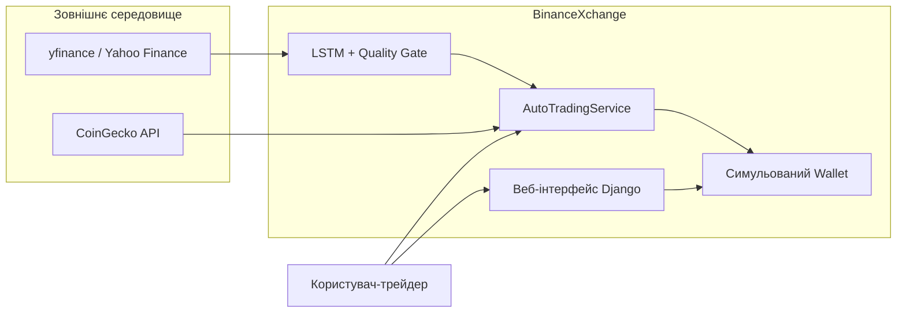
### Рис. 1.7
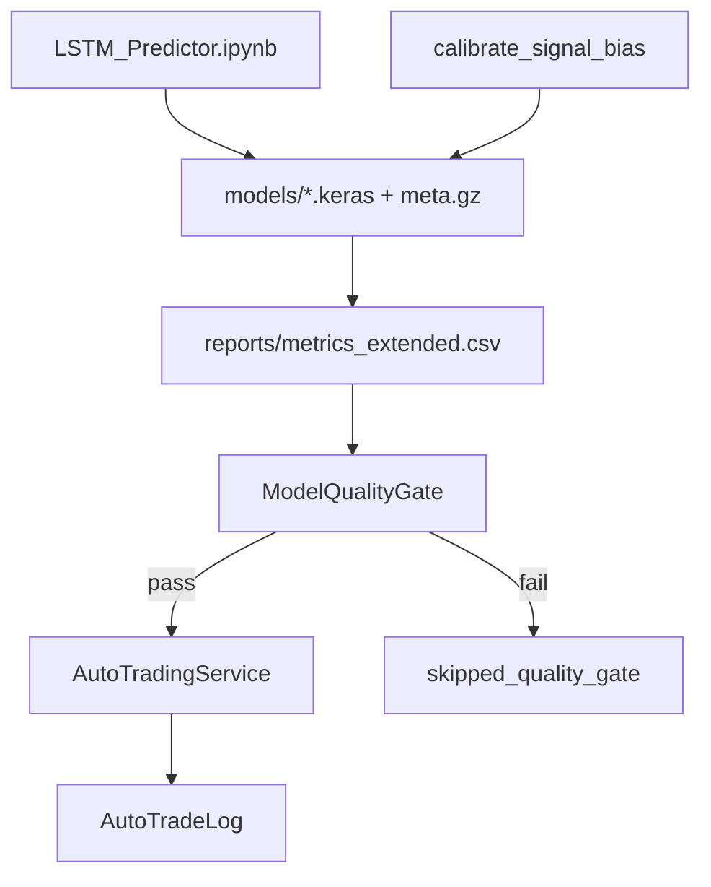
### Рис. 1.11
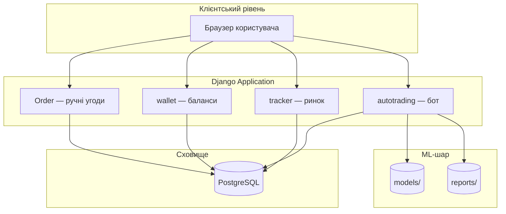
---

## Розділ 2. Архітектура та проєктування

### Рис. 2.2

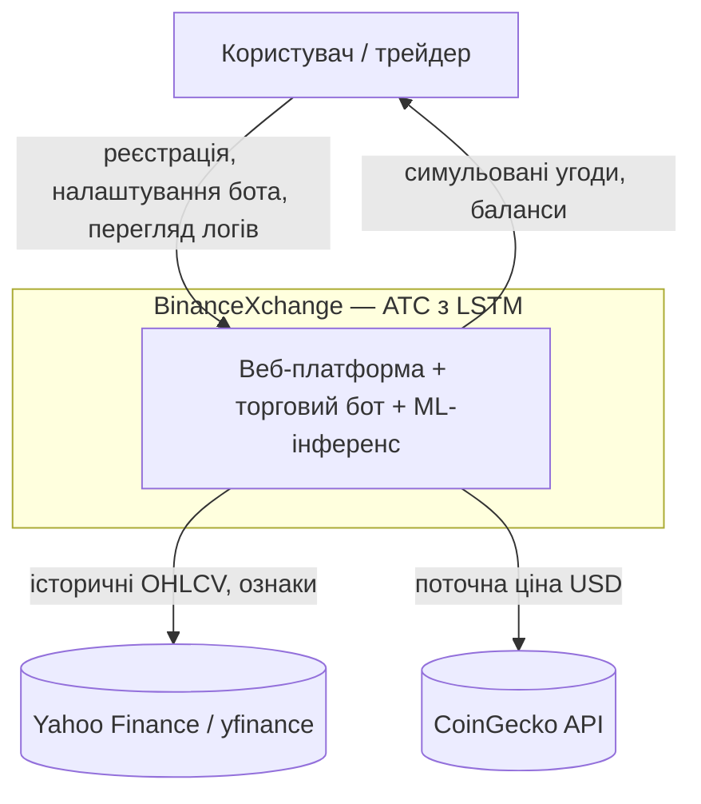

### Рис. 2.3

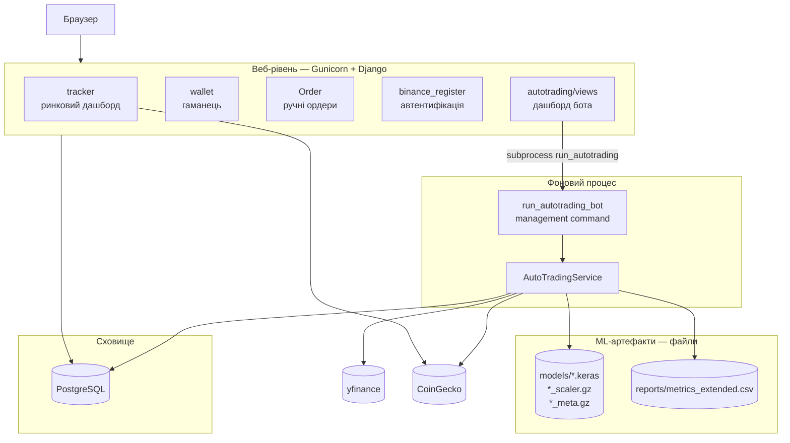

### Рис. 2.4

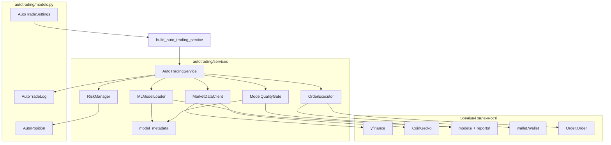

### Рис. 2.5

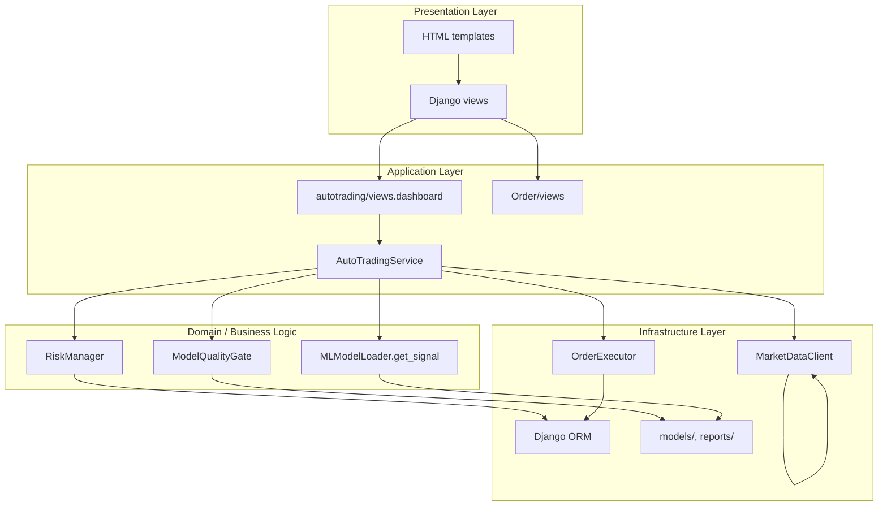

### Рис. 2.6

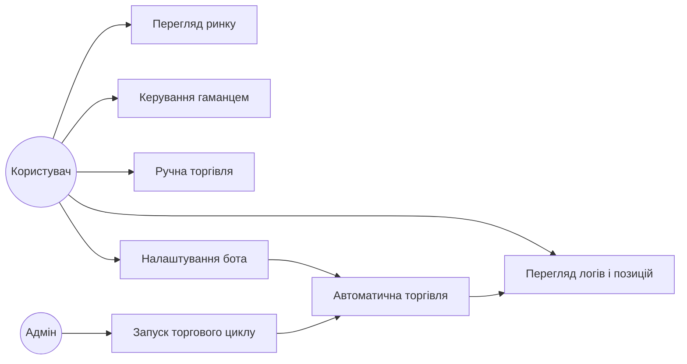

### Рис. 2.7

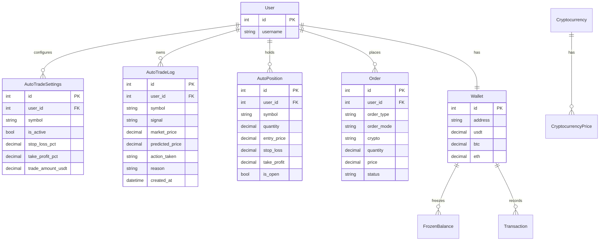

### Рис. 2.8

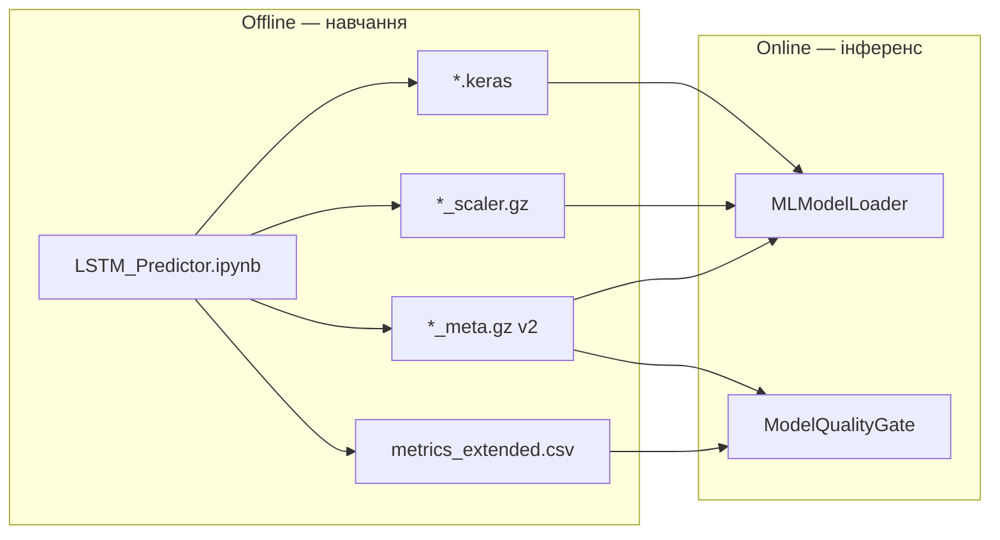

### Рис. 2.9

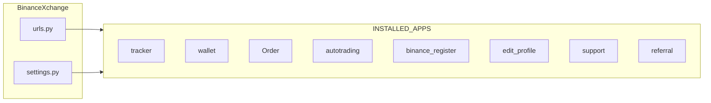

### Рис. 2.10

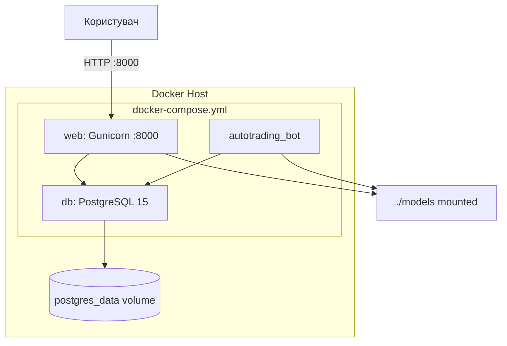

---